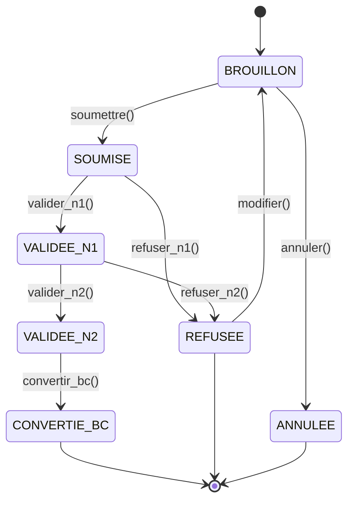
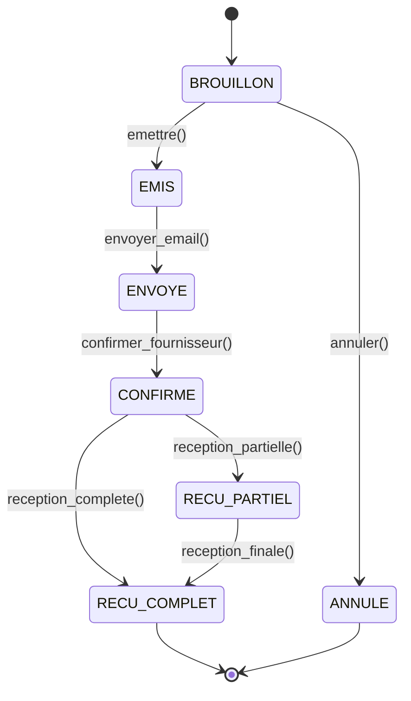
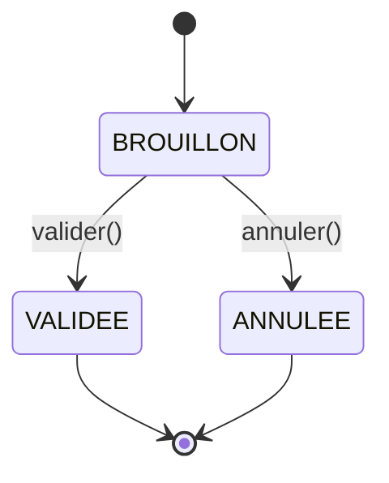

# Spécifications Fonctionnelles pour Tests - Module GAC

**Version**: 1.0  
**Date**: 04/02/2026  
**Projet**: HR_ONIAN  
**Module**: Gestion des Achats & Commandes  
**Auteur**: Analyse des specs techniques

---

## Table des matières

1. [Vue d'ensemble du module](#1-vue-densemble-du-module)
2. [Acteurs et rôles](#2-acteurs-et-rôles)
3. [Workflows principaux](#3-workflows-principaux)
4. [Scénarios de tests par fonctionnalité](#4-scénarios-de-tests-par-fonctionnalité)
5. [Cas de test détaillés](#5-cas-de-test-détaillés)
6. [Données de test](#6-données-de-test)
7. [Validation des règles métier](#7-validation-des-règles-métier)

---

## 1. Vue d'ensemble du module

### 1.1 Objectif
Digitaliser et automatiser le processus d'achat complet de l'entreprise, de la demande initiale à la réception des marchandises.

### 1.2 Périmètre fonctionnel
- ✅ Gestion des demandes d'achat avec workflow de validation
- ✅ Gestion des bons de commande (émission, envoi, suivi)
- ✅ Gestion des fournisseurs (création, évaluation, suivi)
- ✅ Catalogue produits interne (articles, catégories, prix)
- ✅ Gestion budgétaire (contrôle, alertes, reporting)
- ✅ Réception et contrôle des livraisons
- ✅ Tableaux de bord et reporting

### 1.3 Modules techniques
- **12 modèles** de données (1788 lignes)
- **9 services** métier (3779 lignes)
- **7 vues** principales (1787 lignes)
- **46 templates** HTML (~3500 lignes)
- **73 routes** URL

---

## 2. Acteurs et rôles

### 2.1 Rôles définis

| Rôle | Code | Description | Permissions principales |
|------|-------|-------------|-------------------------|
| Demandeur | `DEMANDEUR` | Tout employé pouvant créer une demande | Créer demandes, voir ses demandes |
| Validateur N1 | `VALIDATEUR_N1` | Manager validant les demandes de son équipe | Valider N1, refuser N1 |
| Validateur N2 | `VALIDATEUR_N2` | Direction/Responsable achats | Valider N2, refuser N2 |
| Acheteur | `ACHETEUR` | Gestion des bons de commande | Créer/émettre BCs, validation N2 |
| Réceptionnaire | `RECEPTIONNAIRE` | Réception des marchandises | Enregistrer/valider réceptions |
| Gestionnaire Budget | `GESTIONNAIRE_BUDGET` | Gestion des enveloppes budgétaires | Gérer budgets, voir alertes |
| Admin GAC | `ADMIN_GAC` | Administrateur complet du module | Tous les droits |

### 2.2 Hiérarchie des permissions
```
ADMIN_GAC (tous les droits)
    ├── GESTIONNAIRE_BUDGET
    ├── ACHETEUR (inclut VALIDATEUR_N2)
    │   └── VALIDATEUR_N1
    │       └── RECEPTIONNAIRE
    │           └── DEMANDEUR
```

---

## 3. Workflows principaux

### 3.1 Workflow Demande d'Achat



### 3.2 Workflow Bon de Commande



### 3.3 Workflow Réception



---

## 4. Scénarios de tests par fonctionnalité

### 4.1 Demandes d'Achat

#### 4.1.1 Création de demande
- **Cas nominal** : Création réussie avec toutes les informations
- **Cas limites** : Champs obligatoires manquants, budget insuffisant
- **Cas erreur** : Utilisateur sans permission, données invalides

#### 4.1.2 Workflow de validation
- **Validation N1** : Manager valide la demande de son équipe
- **Validation N2** : Direction valide les demandes importantes
- **Refus** : Motivation obligatoire, retour au brouillon
- **Annulation** : Uniquement par le demandeur

#### 4.1.3 Conversion en BC
- **Automatique** : Depuis demande VALIDEE_N2
- **Manuelle** : Par l'acheteur
- **Vérification** : Lignes transférées correctement

### 4.2 Bons de Commande

#### 4.2.1 Création et émission
- **Depuis demande** : Conversion automatique
- **Manuelle** : Création directe par acheteur
- **PDF** : Génération automatique du document

#### 4.2.2 Envoi et suivi
- **Email** : Envoi automatique au fournisseur
- **Confirmation** : Suivi de la réponse fournisseur
- **Statuts** : Mise à jour automatique

#### 4.2.3 Annulation
- **Conditions** : BC non confirmé
- **Impact** : Libération du budget

### 4.3 Fournisseurs

#### 4.3.1 Gestion
- **Création** : Validation SIRET, email, IBAN
- **Modification** : Mise à jour des informations
- **Désactivation** : Suspension temporaire

#### 4.3.2 Évaluation
- **Critères** : Qualité, délais, service
- **Notes** : 1 à 5 étoiles
- **Impact** : Sélection pour futurs achats

### 4.4 Catalogue

#### 4.4.1 Articles
- **Création** : Référence unique automatique
- **Prix** : Gestion par fournisseur
- **Statuts** : Actif/inactif/obsolète

#### 4.4.2 Catégories
- **Hiérarchie** : Arborescence illimitée
- **Héritage** : Propriétés parent/enfant

### 4.5 Budgets

#### 4.5.1 Contrôle
- **Vérification** : En temps réel lors des demandes
- **Alertes** : Seuils configurables
- **Reporting** : Suivi des consommations

#### 4.5.2 Gestion
- **Création** : Par exercice budgétaire
- **Affectation** : Par département/projet
- **Suivi** : Historique des mouvements

### 4.6 Réceptions

#### 4.6.1 Enregistrement
- **Contrôle** : Quantités vs commandées
- **Non-conformités** : Signalement automatique
- **Validation** : Par réceptionnaire habilité

#### 4.6.2 Impact
- **Stocks** : Mise à jour automatique
- **Facturation** : Déclenchement processus
- **Historique** : Traçabilité complète

---

## 5. Cas de test détaillés

### 5.1 Tests Demandes d'Achat

#### TC-DA-001: Création demande brouillon
**Objectif**: Vérifier la création d'une demande en brouillon

**Prérequis**:
- Utilisateur avec rôle DEMANDEUR
- Budget disponible
- Articles existants

**Données de test**:
```python
demande_data = {
    "objet": "Achat de matériel informatique",
    "justification": "Remplacement poste défectueux",
    "budget": "BUD-2026-001",
    "priorite": "NORMALE",
    "lignes": [
        {
            "article": "ART-0001",
            "quantite": 2,
            "prix_unitaire": 850.00
        }
    ]
}
```

**Actions**:
1. Se connecter en tant que demandeur
2. Accéder à la page de création de demande
3. Remplir le formulaire
4. Ajouter une ligne
5. Sauvegarder en brouillon

**Résultats attendus**:
- Demande créée avec statut BROUILLON
- Numéro automatique généré (DA-2026-XXXX)
- Ligne ajoutée correctement
- Budget non impacté

**Vérifications**:
- [ ] Statut = BROUILLON
- [ ] Numéro format correct
- [ ] Montant total calculé
- [ ] Historique créé

---

#### TC-DA-002: Soumission pour validation
**Objectif**: Vérifier la soumission d'une demande

**Prérequis**:
- Demande en brouillon
- Au moins une ligne
- Demandeur avec manager défini

**Actions**:
1. Accéder à la demande brouillon
2. Cliquer sur "Soumettre"
3. Confirmer la soumission

**Résultats attendus**:
- Statut passe à SOUMISE
- Date de soumission enregistrée
- Validateur N1 notifié
- Email envoyé au validateur

**Vérifications**:
- [ ] Statut = SOUMISE
- [ ] Date_soumission non vide
- [ ] Validateur_N1 assigné
- [ ] Notification créée
- [ ] Email envoyé

---

#### TC-DA-003: Validation N1
**Objectif**: Vérifier la validation par le manager

**Prérequis**:
- Demande soumise
- Utilisateur = validateur N1

**Actions**:
1. Accéder aux demandes à valider
2. Ouvrir la demande
3. Cliquer sur "Valider N1"
4. Ajouter commentaire
5. Confirmer

**Résultats attendus**:
- Statut passe à VALIDEE_N1
- Date validation N1 enregistrée
- Validateur N2 notifié
- Commentaire enregistré

**Vérifications**:
- [ ] Statut = VALIDEE_N1
- [ ] Date_validation_n1 non vide
- [ ] Validateur_N2 assigné
- [ ] Commentaire présent
- [ ] Historique mis à jour

---

#### TC-DA-004: Refus N1
**Objectif**: Vérifier le refus avec retour au brouillon

**Prérequis**:
- Demande soumise
- Utilisateur = validateur N1

**Actions**:
1. Accéder à la demande
2. Cliquer sur "Refuser"
3. Saisir motif de refus
4. Confirmer

**Résultats attendus**:
- Statut passe à REFUSEE
- Motif de refus enregistré
- Demandeur notifié
- Possibilité de modifier

**Vérifications**:
- [ ] Statut = REFUSEE
- [ ] Motif refus présent
- [ ] Notification demandeur
- [ ] Bouton modifier visible

---

#### TC-DA-005: Conversion en Bon de Commande
**Objectif**: Vérifier la conversion automatique

**Prérequis**:
- Demande VALIDEE_N2
- Utilisateur = ACHETEUR

**Actions**:
1. Accéder à la demande
2. Cliquer sur "Convertir en BC"
3. Sélectionner fournisseur
4. Confirmer

**Résultats attendus**:
- BC créé avec mêmes lignes
- Statut demande = CONVERTIE_BC
- Budget engagé
- PDF généré

**Vérifications**:
- [ ] BC créé
- [ ] Lignes transférées
- [ ] Statut demande mis à jour
- [ ] Budget impacté
- [ ] PDF disponible

---

### 5.2 Tests Bons de Commande

#### TC-BC-001: Émission Bon de Commande
**Objectif**: Vérifier l'émission d'un BC

**Prérequis**:
- BC en brouillon
- Utilisateur = ACHETEUR

**Actions**:
1. Accéder au BC brouillon
2. Cliquer sur "Émettre"
3. Confirmer

**Résultats attendus**:
- Statut passe à EMIS
- Numéro BC généré
- Date émission enregistrée
- PDF généré

**Vérifications**:
- [ ] Statut = EMIS
- [ ] Numéro format BC-XXXX
- [ ] Date_emission non vide
- [ ] PDF disponible

---

#### TC-BC-002: Envoi par email
**Objectif**: Vérifier l'envoi au fournisseur

**Prérequis**:
- BC émis
- Fournisseur avec email valide

**Actions**:
1. Accéder au BC émis
2. Cliquer sur "Envoyer"
3. Confirmer envoi

**Résultats attendus**:
- Statut passe à ENVOYE
- Email envoyé
- Date envoi enregistrée
- Historique mis à jour

**Vérifications**:
- [ ] Statut = ENVOYE
- [ ] Date_envoi non vide
- [ ] Email envoyé (logs)
- [ ] Historique créé

---

#### TC-BC-003: Confirmation fournisseur
**Objectif**: Vérifier la confirmation par le fournisseur

**Prérequis**:
- BC envoyé
- Accès fournisseur (simulation)

**Actions**:
1. Simuler réponse fournisseur
2. Marquer comme confirmé

**Résultats attendus**:
- Statut passe à CONFIRME
- Date confirmation enregistrée
- Préparation pour réception

**Vérifications**:
- [ ] Statut = CONFIRME
- [ ] Date_confirmation non vide
- [ ] Boutons réception actifs

---

### 5.3 Tests Fournisseurs

#### TC-FO-001: Création fournisseur
**Objectif**: Vérifier la création d'un fournisseur

**Prérequis**:
- Utilisateur = ACHETEUR ou ADMIN_GAC

**Données de test**:
```python
fournisseur_data = {
    "raison_sociale": "Société Test Informatique",
    "siret": "12345678901234",
    "email": "contact@test-info.fr",
    "telephone": "0123456789",
    "adresse": "1 Rue de la Test",
    "code_postal": "75001",
    "ville": "Paris",
    "contact_nom": "Durand",
    "contact_prenom": "Jean",
    "iban": "FR7630004000031234567890143"
}
```

**Actions**:
1. Accéder à création fournisseur
2. Remplir le formulaire
3. Sauvegarder

**Résultats attendus**:
- Fournisseur créé
- Code automatique généré
- Validations SIRET/IBAN passées
- Statut ACTIF

**Vérifications**:
- [ ] Code format FRN-XXXX
- [ ] SIRET valide
- [ ] IBAN valide
- [ ] Statut = ACTIF
- [ ] Historique créé

---

#### TC-FO-002: Évaluation fournisseur
**Objectif**: Vérifier l'évaluation après commande

**Prérequis**:
- Fournisseur avec commandes
- Utilisateur = ACHETEUR

**Actions**:
1. Accéder au fournisseur
2. Cliquer sur "Évaluer"
3. Noter sur 5 critères
4. Ajouter commentaire
5. Sauvegarder

**Résultats attendus**:
- Note globale calculée
- Commentaire enregistré
- Historique mis à jour
- Impact sur sélection future

**Vérifications**:
- [ ] Note entre 1 et 5
- [ ] Commentaire présent
- [ ] Date évaluation
- [ ] Historique créé

---

### 5.4 Tests Catalogue

#### TC-CA-001: Création article
**Objectif**: Vérifier la création d'un article

**Prérequis**:
- Catégorie existante
- Utilisateur = ADMIN_GAC

**Données de test**:
```python
article_data = {
    "designation": "Ordinateur portable Pro",
    "description": "PC portable 15 pouces, 16Go RAM, 512Go SSD",
    "prix_unitaire": 1200.00,
    "taux_tva": 20.0,
    "unite": "PIECE",
    "categorie": "CAT-001",
    "fournisseurs": ["FRN-001", "FRN-002"]
}
```

**Actions**:
1. Accéder à création article
2. Remplir le formulaire
3. Associer fournisseurs
4. Sauvegarder

**Résultats attendus**:
- Article créé
- Référence automatique
- Catégorie associée
- Fournisseurs liés

**Vérifications**:
- [ ] Référence format ART-XXXX
- [ ] Prix correct
- [ ] TVA appliquée
- [ ] Fournisseurs associés

---

#### TC-CA-002: Recherche article
**Objectif**: Vérifier la recherche avancée

**Prérequis**:
- Articles existants
- Catégories hiérarchiques

**Actions**:
1. Accéder à la liste des articles
2. Utiliser filtre par texte
3. Utiliser filtre par catégorie
4. Utiliser filtre par statut

**Résultats attendus**:
- Résultats filtrés correctement
- Filtres combinés fonctionnels
- Pagination fonctionnelle

**Vérifications**:
- [ ] Recherche texte fonctionne
- [ ] Filtre catégorie fonctionne
- [ ] Filtre statut fonctionne
- [ ] Combinaison filtres OK

---

### 5.5 Tests Budgets

#### TC-BU-001: Contrôle budgétaire
**Objectif**: Vérifier le contrôle lors d'une demande

**Prérequis**:
- Budget avec solde limité
- Demande importante

**Actions**:
1. Créer demande dépassant budget
2. Soumettre la demande

**Résultats attendus**:
- Alerte budget affichée
- Possibilité de justifier
- Validation spéciale requise

**Vérifications**:
- [ ] Alerte affichée
- [ ] Pourcentage calculé
- [ ] Message d'avertissement
- [ ] Demande bloquée ou avertissement

---

#### TC-BU-002: Alertes budgétaires
**Objectif**: Vérifier les alertes automatiques

**Prérequis**:
- Budget à 80% de consommation
- Commande CRON configurée

**Actions**:
1. Exécuter commande vérification
2. Vérifier notifications

**Résultats attendus**:
- Alertes générées
- Emails envoyés
- Tableau de bord mis à jour

**Vérifications**:
- [ ] Notifications créées
- [ ] Emails envoyés
- [ ] Dashboard alertes
- [ ] Historique alertes

---

### 5.6 Tests Réceptions

#### TC-RE-001: Réception complète
**Objectif**: Vérifier la réception complète d'une commande

**Prérequis**:
- BC confirmé
- Utilisateur = RECEPTIONNAIRE

**Actions**:
1. Accéder à réception depuis BC
2. Saisir quantités reçues
3. Confirmer conformité
4. Valider la réception

**Résultats attendus**:
- Réception créée
- Statut BC = RECU_COMPLET
- Stocks mis à jour
- Facturation déclenchée

**Vérifications**:
- [ ] Réception valide
- [ ] Quantités correctes
- [ ] Statut BC mis à jour
- [ ] Historique créé

---

#### TC-RE-002: Réception partielle
**Objectif**: Vérifier la réception partielle

**Prérequis**:
- BC avec plusieurs lignes
- Livraison partielle

**Actions**:
1. Créer réception partielle
2. Saisir quantités partielles
3. Valider

**Résultats attendus**:
- Statut BC = RECU_PARTIEL
- Lignes concernées marquées
- Solde à recevoir calculé

**Vérifications**:
- [ ] Statut = RECU_PARTIEL
- [ ] Quantités partielles
- [ ] Solde calculé
- [ ] Possibilité réception finale

---

#### TC-RE-003: Non-conformité
**Objectif**: Vérifier la gestion des non-conformités

**Prérequis**:
- Réception avec défauts
- Utilisateur = RECEPTIONNAIRE

**Actions**:
1. Signaler non-conformité
2. Décrire le problème
3. Prendre photo (si possible)
4. Valider avec réserve

**Résultats attendus**:
- Non-conformité enregistrée
- Fournisseur notifié
- Processus retour initié

**Vérifications**:
- [ ] Non-conformité créée
- [ ] Description présente
- [ ] Notification fournisseur
- [ ] Statut approprié

---

## 6. Données de test

### 6.1 Utilisateurs de test

```python
utilisateurs_test = {
    "demandeur": {
        "username": "jean.demandeur",
        "email": "j.demandeur@company.com",
        "roles": ["DEMANDEUR"],
        "manager": "manager.test"
    },
    "manager": {
        "username": "manager.test",
        "email": "manager@company.com",
        "roles": ["DEMANDEUR", "VALIDATEUR_N1"],
        "equipe": ["jean.demandeur", "marie.demandeur"]
    },
    "directeur": {
        "username": "directeur.achats",
        "email": "d.achats@company.com",
        "roles": ["DEMANDEUR", "VALIDATEUR_N1", "VALIDATEUR_N2", "ACHETEUR"]
    },
    "receptionnaire": {
        "username": "paul.reception",
        "email": "p.reception@company.com",
        "roles": ["RECEPTIONNAIRE"]
    },
    "admin": {
        "username": "admin.gac",
        "email": "admin.gac@company.com",
        "roles": ["ADMIN_GAC"]
    }
}
```

### 6.2 Budgets de test

```python
budgets_test = [
    {
        "code": "BUD-2026-INFRA",
        "libelle": "Budget Infrastructure 2026",
        "montant_initial": 100000.00,
        "exercice": 2026,
        "gestionnaire": "directeur.achats"
    },
    {
        "code": "BUD-2026-OFFICE",
        "libelle": "Budget Fournitures Bureau 2026",
        "montant_initial": 25000.00,
        "exercice": 2026,
        "gestionnaire": "manager.test"
    }
]
```

### 6.3 Fournisseurs de test

```python
fournisseurs_test = [
    {
        "raison_sociale": "InfoMatériel Pro",
        "siret": "12345678901234",
        "email": "contact@infomateriel.fr",
        "categorie": "INFORMATIQUE",
        "delai_livraison": 7
    },
    {
        "raison_sociale": "BureauPlus",
        "siret": "98765432109876",
        "email": "commande@bureau-plus.fr",
        "categorie": "FOURNITURES",
        "delai_livraison": 3
    }
]
```

### 6.4 Articles de test

```python
articles_test = [
    {
        "designation": "Ordinateur Portable Pro",
        "reference": "ART-0001",
        "prix_unitaire": 1200.00,
        "taux_tva": 20.0,
        "unite": "PIECE",
        "categorie": "Informatique"
    },
    {
        "designation": "Cartouche d'encre Noir",
        "reference": "ART-0002",
        "prix_unitaire": 45.00,
        "taux_tva": 20.0,
        "unite": "PIECE",
        "categorie": "Fournitures Bureau"
    }
]
```

---

## 7. Validation des règles métier

### 7.1 Règles de validation

#### Demandes d'Achat
- [ ] Une demande doit avoir au moins une ligne
- [ ] Le montant total doit être supérieur à 0
- [ ] Le demandeur doit avoir un validateur N1 défini
- [ ] Le budget doit être suffisant (selon configuration)
- [ ] Les articles doivent être actifs

#### Bons de Commande
- [ ] Un BC doit avoir au moins une ligne
- [ ] Le fournisseur doit être actif
- [ ] Les prix doivent correspondre aux catalogues
- [ ] Le total TTC doit être calculé correctement

#### Fournisseurs
- [ ] Le SIRET doit être valide (14 chiffres)
- [ ] L'IBAN doit être valide (format français)
- [ ] L'email doit être unique
- [ ] Le code doit être unique

#### Budgets
- [ ] Le montant initial doit être positif
- [ ] La date de fin doit être postérieure à la date de début
- [ ] L'exercice doit correspondre à l'année

### 7.2 Contrôles d'intégrité

#### Workflow
- [ ] Les transitions d'état respectent le workflow
- [ ] Les permissions sont vérifiées avant chaque action
- [ ] L'historique est mis à jour pour chaque action
- [ ] Les notifications sont envoyées automatiquement

#### Calculs
- [ ] Les montants HT sont calculés correctement
- [ ] La TVA est appliquée selon les taux
- [ ] Les totaux TTC sont exacts
- [ ] Les conversions de devise sont correctes

#### Notifications
- [ ] Les emails sont envoyés aux bons destinataires
- [ ] Les notifications in-app sont créées
- [ ] Les rappels automatiques fonctionnent
- [ ] Les alertes budgétaires sont générées

---

## 8. Scénarios de test end-to-end

### 8.1 Scénario complet : Achat d'ordinateur

**Objectif**: Tester le workflow complet d'un achat simple

**Acteurs**: Jean (demandeur), Manager (validateur N1), Directeur (validateur N2/acheteur), Paul (réceptionnaire)

**Étapes**:
1. **Création demande** (Jean)
   - Créer demande pour 2 ordinateurs
   - Ajouter justification
   - Soumettre

2. **Validation N1** (Manager)
   - Recevoir notification
   - Examiner la demande
   - Valider avec commentaire

3. **Validation N2** (Directeur)
   - Recevoir notification
   - Vérifier budget disponible
   - Valider

4. **Conversion BC** (Directeur)
   - Convertir en bon de commande
   - Sélectionner fournisseur InfoMatériel Pro
   - Émettre le BC

5. **Envoi BC** (Directeur)
   - Envoyer par email au fournisseur
   - Confirmer envoi

6. **Confirmation fournisseur** (Simulation)
   - Marquer BC comme confirmé

7. **Réception** (Paul)
   - Enregistrer réception des 2 ordinateurs
   - Contrôler conformité
   - Valider réception

**Vérifications finales**:
- [ ] Demande statut CONVERTIE_BC
- [ ] BC statut RECU_COMPLET
- [ ] Budget engagé puis consommé
- [ ] Stocks mis à jour
- [ ] Historique complet
- [ ] Tous les acteurs notifiés

### 8.2 Scénario complexe : Refus et correction

**Objectif**: Tester le gestion des refus et corrections

**Étapes**:
1. **Création demande** avec montant élevé
2. **Validation N1** réussie
3. **Refus N2** pour motif budget insuffisant
4. **Correction** par le demandeur
5. **Resoumission** avec justification
6. **Validation N2** avec autorisation spéciale

**Vérifications**:
- [ ] Refus enregistré avec motif
- [ ] Retour au statut BROUILLON
- [ ] Historique des modifications
- [ ] Nouvelle soumission réussie

---

## 9. Checklist de validation finale

### 9.1 Fonctionnalités obligatoires
- [ ] Création/modification demandes
- [ ] Workflow validation complet
- [ ] Conversion en bons de commande
- [ ] Gestion fournisseurs
- [ ] Catalogue articles fonctionnel
- [ ] Contrôle budgétaire
- [ ] Réceptions et contrôles
- [ ] Reporting et tableaux de bord

### 9.2 Sécurité et permissions
- [ ] Rôles correctement définis
- [ ] Permissions respectées
- [ ] Accès non autorisés bloqués
- [ ] Données filtrées par rôle

### 9.3 Performance et UX
- [ ] Temps de réponse < 2s
- [ ] Interface responsive
- [ ] Messages d'erreur clairs
- [ ] Navigation intuitive

### 9.4 Intégration
- [ ] Emails envoyés correctement
- [ ] PDFs générés
- [ ] Notifications in-app
- [ ] Historique complet

### 9.5 Qualité
- [ ] Code testé unitairement
- [ ] Workflow exhaustivement testé
- [ ] Edge cases couverts
- [ ] Documentation complète

---

**Cette spécification fonctionnelle sert de guide complet pour tester tous les aspects du module GAC. Les tests doivent être exécutés dans l'ordre des scénarios pour valider le fonctionnement complet du système.**
